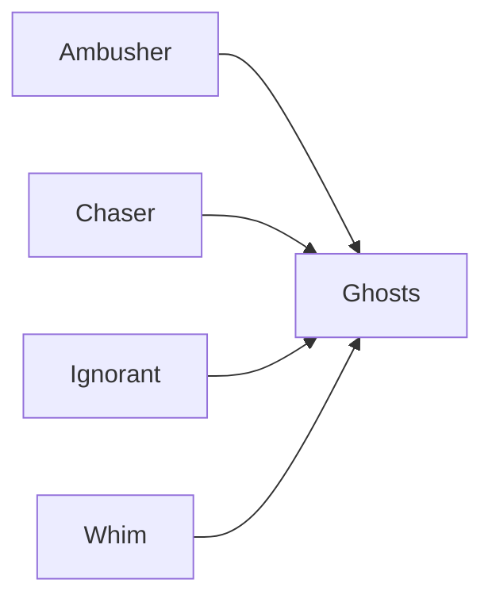
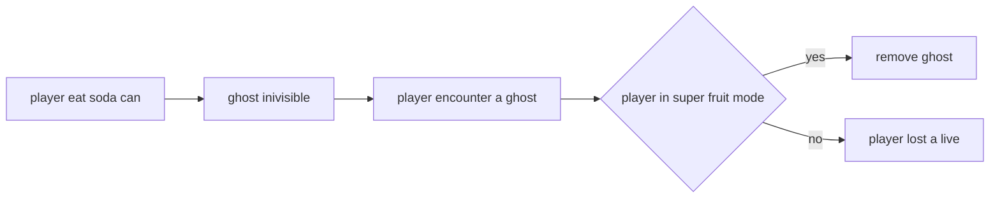

# INFO 1113 REPORT

Student id: 500425334

---

## Explanation of object-oriented design decisions

### App.java

App.java is extends from PApplet.java, which is the graphic library. This class override four methods from PApplet.java, setting(), setup(), draw() and KeyPressed(KeyEvent e). 

* In setting method, the basic attributes of game window will be set. 

* In setup() method, the first frame of the game will be executed, map, player, ghosts' information will be loaded. 

* draw() method will be called at each frame, it will update the information of  the game and redraw the game screen.
* KeyPressed() will continuously listen to the keyboard and response.

### Ghosts

Ghosts.java is the super class of all ghosts, it is a abstract class with abstract method findTarget().

All ghosts have the same logic when they are moving, they only make decision when they encounter a corner, never turn back except they have nowhere to go to.

Hence, methods such as countingDistance(), walk(), intersection() and etc. will be inherited.

For this four kinds of ghost, they have different logic to find their target, so findTarget() have to be implemented in Ambusher.java, Chaser.java, Ignorant.java and Whim.java.

### Exception

In ConfigReader().java, it might throw a exception when config.json is no exist.

## Explanation of how the extension has been implemented

Extension: Collectable soda-can that frightens ghosts and turns them invisible for a period of time.

A new data field called sodaLength is added in config.json, it determine the length of effect that ghost turn invisible.

When player eat a soda can, ghost will turn invisible, during this period of time, if player encounter a ghost and player is not in super fruit mode, player will lost a live, otherwise, ghost will be eliminated.

